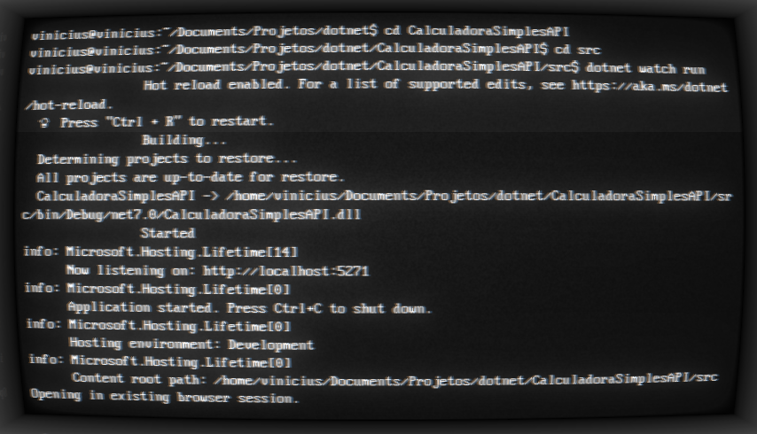
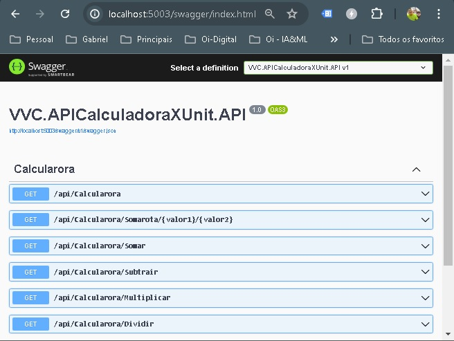

# Testes Calculadora XUnit 

Pequeno exemplo de Teste Unitario com xUnit no .Net Core. 


GitHub : https://github.com/ViniciusVC/dotnet/tree/main/VVC.APICalculadoraXUnit/

# Projetos nesta Solução 
```
📂 VVC.APICalculadoraXUnit
│   
├── 📂 /VVC.APICalculadoraXUnit.API
│   projeto de API
│
├── 📂 /VVC.APICalculadoraXUnit.Test
    projeto de teste .NET com xUnit.
    Codigos de test em CalculadoraTest.cs.
```

Saida no terminal:


# Criar a solução:
> dotnet new sln -n VVC.APICalculadoraXUnit

# Criar um projeto API:
> dotnet new webapi -n VVC.APICalculadoraXUnit.API


# Rodando projeto API
> cd VVC.APICalculadoraXUnit.API

Rodar projeto: 
>  dotnet run

Rodar com atualização automatica:
> dotnet watch run

Rodar o projeto de fora do diretorio:
> dotnet run --project ./VVC.APICalculadoraXUnit.API/VVC.APICalculadoraXUnit.API.csproj

Saida:




### Swagger
```
Swagger é um front apenas para teste de API.
Abre uma pagina em com Swagger em:
http://localhost:5003/swagger/index.html
```


Criar classe
```
//Apage os codigos criados por padrão e crie um arquivo controllers.
// crie a pasta Models
mkdir Models
crie o arquivo da classe model nesta pasta.

```
Endpoints
```
//Apage os codigos criados por padrão e crie um arquivo controllers.
// crie a pasta Models
mkdir Models
crie o arquivo da classe model nesta pasta.

```

# Criar o projeto XUnit:
```
Criando o projeto de teste:
$ dotnet new xunit -n VVC.APICalculadoraXUnit.Test

Adicione este projeto na solução:
$ dotnet sln VVC.APICalculadoraXUnit.sln add VVC.APICalculadoraXUnit.Test/VVC.APICalculadoraXUnit.Test.csproj

Adicione a referência do Projeto API no Projeto Test:
$ dotnet add VVC.APICalculadoraXUnit.Test/VVC.APICalculadoraXUnit.Test.csproj reference VVC.APICalculadoraXUnit.API/VVC.APICalculadoraXUnit.API.csproj
```

Rodar aos testes:
> dotnet test


# Punlish:
```
Publicar o projeto:
sudo dotnet publish --framework net8.0 --runtime osx-x64

Pasta de saida:
/VVC.DotNetAPICalculadora/src/bin/Release/net8.0/osx-x64

Rodar projeto publicado:
/bin/Release/net8.0/osx-x64$ dotnet CalculadoraSimplesAPI.dll

O projeto publicado(produção) roda na porta 5000.
http://localhost:5003/api/Calcularora
```


# docker
```
Para gerar a imagem:
$ sudo docker build . -t vvcdotnetapicalculadoraimg

Criar um contêiner a partir da imagem que vc criou:
$ sudo docker run -d -p 5000:5271 --name dotnet_api_calculadora vvcdotnetapicalculadoraimg

Para a execução do contêiner: 
$ sudo docker stop dotnet_api_calculadora
```
