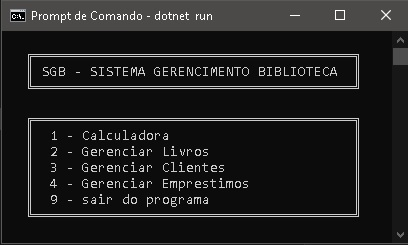
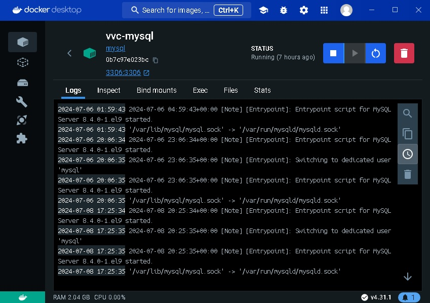

## VVC.Biblioteca

Projetinho de gerenciamento de biblioteca.
Aqui temos alguns projetos exemplo de DotNet (API, Console e XUnit).


https://github.com/ViniciusVC/dotnet/tree/main/VVC.Biblioteca


# Projetos
```
📂 VVC.Biblioteca
│   
├── 📂 VVC.Biblioteca.API
│   (WEBAPI - Docker) 
│
├── 📂 VVC.Biblioteca.Terminal
│   (Sistema via console)
│
├── 📂 VVC.Biblioteca.Test
   (teste unitario com xUnit) 

```

 
# Rodar projeto API
```
Projeto API
VVC.Biblioteca.API> dotnet run

Abra o Swagger em:
http://localhost:5123/swagger/index.html
```

# Rodar projeto Console
```
Projeto Console
\VVC.Biblioteca.Terminal> dotnet run
```



# Rodar Testes
```
Rodar testes unitários
VVC.Biblioteca.Test> dotnet test
```

## CRIANDO A SOLUCAO
```
> dotnet new sln
```

## CRIANDO PROJETO API
```
// Criar projeto DotNet Core API:
> dotnet new webapi -n VVC.Biblioteca.API

// Entrar do diretorio do projeto:
> cd VVC.Biblioteca.API

// Instale o pacote para o MySql.
> dotnet add package MySql.Data

// Instale o pacote DataAnnotations
(Para criar modelos de dados).
> dotnet add package System.ComponentModel.DataAnnotations

// 1. Instale o pacote para MySql:
> dotnet add package MySql.EntityFrameworkCore

// 2. Instale o pacote EntityFrameworkCore.Tools
> dotnet add package Microsoft.EntityFrameworkCore.Tools

// 3. Restaure as dependências e ferramentas do projeto:
> dotnet restore

>>> dotnet ef dbcontext scaffold "Server=127.0.0.1:3306;User Id=root;Password=senharoot;Database=dbvvcbiblioteca" "Pomelo.EntityFrameworkCore.MySql" -c MyDbContext
```


## CRIANDO PROJETO CONSOLE
```
// Criar projeto console
> dotnet new console -n VVC.Biblioteca.Terminal
> cd VVC.Biblioteca.Terminal

// Instale o pacote para o MySql no Projeto Console.
> dotnet add package MySql.Data
> dotnet add package MySqlConnector

// Instale o pacote DataAnnotations (Para criar modelos de dados).
> dotnet add package System.ComponentModel.DataAnnotations

Ler a string de conexão do appsettings.json.
Ao contrário de um projeto ASP.NET Core, você precisa criar e ler o arquivo appsettings.json manualmente em um projeto .NET Console. E ler as configurações usando o IConfiguration.

// Instale o Configuration.Json:
> dotnet add package Microsoft.Extensions.Configuration.Json

// Instale o Hosting:
> dotnet add package Microsoft.Extensions.Hosting

```

## CRIANDO PROJETO DE TESTS UNITARIOS
```
// Criar projeto teste
> dotnet new xunit -n VVC.Biblioteca.Test

// Adicionar projeto teste a Solução.
> dotnet sln VVC.Biblioteca.sln add VVC.Biblioteca.test/VVC.Biblioteca.test.csproj

// Referenciar projetos
> dotnet add VVC.Biblioteca.test/VVC.Biblioteca.test.csproj reference VVC.Biblioteca.API/VVC.Biblioteca.API.csproj

```


# Banco de Dados
```
Baixar a imagem do MySQL
c:/> docker pull mysql

Rodar o banco de dados:
C:/> docker run -e MYSQL_ROOT_PASSWORD=senharoot --name vvc-mysql -d -p 3306:3306 mysql

Acesso ao banco:
Hostname : 127.0.0.1
Port : 3306
Username : root
senha : senharoot
Banco de Dados : dbvvcbiblioteca;

Acessar terminal MySQL: 
$ mysql -uroot -p
/p (A porta TCP/IP atual ou arquivo de soquete)

Parar contêiner MySQl:
C:/> docker stop vvc-mysql

Verificar o Ip do contêiner:
C:/> docker inspect vvc-mysql | grep IPAdress

Veja mais no arquivo:
/Docs/CriandoBancoBiblioteca.txt

```


# Docker
```
Execute o contêiner a partir da imagem criada:
$ cd VVC.Biblioteca.API
$ sudo docker run -d -p 8080:80 --name DotNetAPIcontainer DotNetAPI
```


