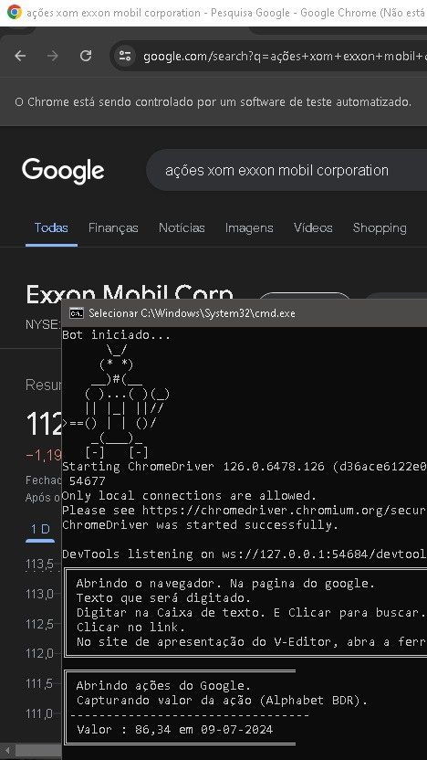
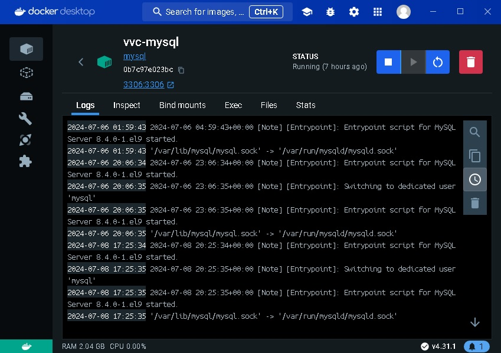

## VVC.BotPessoa

Este é um bot simples dotnet.
Projeto DotNet Core do tipo console.


Repositorio no GIT :
https://github.com/ViniciusVC/dotnet/tree/main/VVC.BotPessoa

# Rodar projeto:
```
    $ dotnet run
```


## Instalar o DotNet no Ubuntu:
> sudo apt-get install -y dotnet-sdk-8.0

## Iniciando projeto:
```
 Crie uma pasta para o projeto:
 $ mkdir VVC.BotPessoa
 $ cd VVC.BotPessoa
 Iniciei um projeto de terminal:
 $ dotnet new console
``` 

# Instalando pacotes Selenium:
```
 Instalar biblioteca:
 & dotnet add package Selenium.WebDriver
 Instalar drives do Chrome:
 $ dotnet add package Selenium.Chrome.WebDriver
 Instalar drives do FireFox:
 $ dotnet add package Selenium.Gecko.WebDriver
```

# Banco de Dados
```
Baixar a imagem do mySQL
c:/> docker pull mysql

Rodar o banco de dados:
C:/> docker run -e MYSQL_ROOT_PASSWORD=senharoot --name vvc-mysql -d -p 3306:3306 mysql

Acesso ao banco:
Hostname : 127.0.0.1
Port : 3306
Username : root
senha : senharoot
Banco de Dados : dbvvcbiblioteca;

Acessar terminal MySQL: 
$ mysql -uroot -p
/p (A porta TCP/IP atual ou arquivo de soquete)

Parar contêiner MySQl:
C:/> docker stop vvc-mysql

Verificar o Ip do contêiner:
C:/> docker inspect vvc-mysql | grep IPAdress

Veja mais no arquivo:
/Docs/CriandoBancoBiblioteca.txt

```

