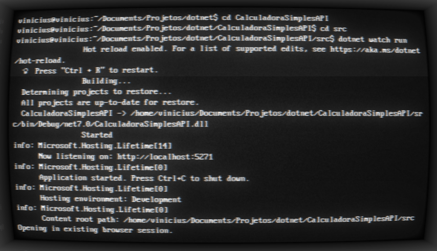
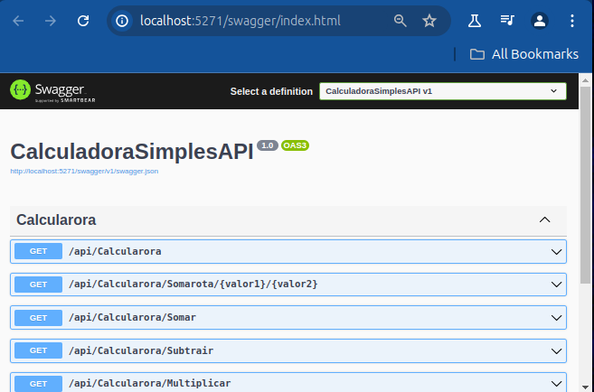

## Projeto Caltuladora Simples API.

Este é um exemplo de projeto DotNet API.

Foi codificado no VSCode no Linux Ubuntu.

/VVC.DotNetAPICalculadora/


[](https://editor.swagger.io/?url=https://raw.githubusercontent.com/lucaro/DRES/master/doc/oas-client.json)

https://github.com/ViniciusVC/dotnet/tree/main/VVC.DotNetAPICalculadora

# Criar projeto .net API
```
$ dotnet new webapi --name CalculadoraSimplesAPI
```

# Rorando servidor (com atualização automatica)
```
$ dotnet watch run
```



# Swagger
```
Swagger é um front apenas para teste de API.
Abre uma pagina em com Swagger em:
http://localhost:5271/swagger/index.html
```



# Controllers
```
Apage os  arquivos controllers criados por padrão.
```

# Criar classe
```
crie a pasta Models
mkdir Models
crie o arquivo da classe model nesta pasta.

```

# docker
```
Para gerar a imagem:
$ sudo docker build . -t dotnet_api_calculadora_img

Criar um contêiner a partir da imagem que vc criou:
$ sudo docker run -d -p 4000:5271 --name dotnet_api_calculadora dotnet_api_calculadora_img

Para a execução do contêiner: 
$ sudo docker stop dotnet_api_calculadora
```
