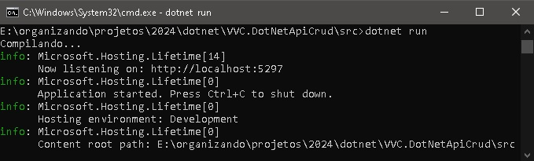
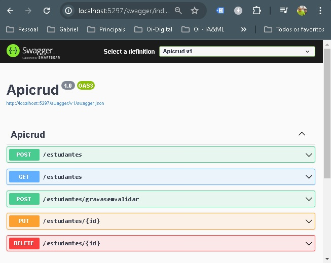

## VVC.DotNetAPI

Este é um exemplo de DotNet API com CRUD.

/csharp_api/

https://github.com/ViniciusVC/dotnet/tree/main/VVC.DotNetApiCrud

# Instale o EntityFramework :
> dotnet tool install –global dotnet-ef

Confirmar se o EF está instalado no seu projeto:
> dotnet ef
Se não estiver instale o ef (Entity Framework) como uma ferramenta global:
> dotnet tool install --global dotnet-ef

# Criando o proejto:
> dotnet new webapi --name Apicrud -minimal

webapi : Projeto Web API

--name : Nome do projeto “Apicrud”

-minimal : Proejeto sem CONTROLLER

Criar classes Controller, Model e Context.

Incluindo o This no método( função) da classe controller, para ele ser chamada automaticamente no Program.cs.

ex.:
>public static void AddRotasEstudantes(this WebApplication app)

## 1º Instalar o EF
Instale EF no seu projeto:
> dotnet add package Microsoft.EntityFrameworkCore

## 2º Instalar o pacote para o Banco de Dados que irá usar.
instalar o SQLite para EF:
> dotnet add package Microsoft.EntityFrameworkCore.Sqlite

No CONTEXT declare que a classe estudante é uma tabela.
>private DbSet<Estudante> Estudantes(get;set;)

Instale o pacote Microsoft.EntityFrameworkCore.Design:
> dotnet add package Microsoft.EntityFrameworkCore.Design

Criar migração:
> dotnet ef migrations add Inicial

 (Gera scripts para migração)

Inicial é o nome da migração

Aplicar migração o add ao banco:

> dotnet ef database update

 (Gera as tabelas no SQLite, baseado nas nossas classes)

### Rodar projeto:

> \src>dotnet run

## Swagger:
> http://localhost:5297/swagger/index.html

(Nota swagger foi descontinuado)