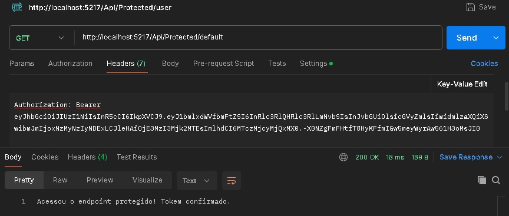
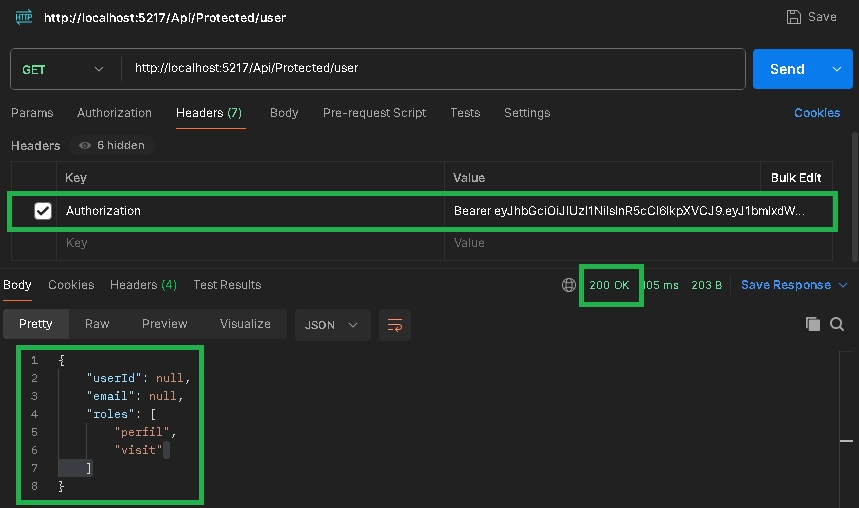

## Projeto Caltuladora Simples API.

Este é um exemplo de projeto DotNet API e Token com JWT no .Net.
Codificado no VisualStudio 2022.


/VVC.DotNetAPICalculadora/


https://github.com/ViniciusVC/dotnet/tree/main/VVC.DotNetAPIAPITokensJWT


# Rorando servidor (com atualização automatica)
```
$ dotnet watch run
```


# Abre o Swagger em:
> http://localhost:5271/swagger/index.html

Teste de acesso 1:


Teste de acesso 2:



### Dependencia JWTBearer
```
Instalar pacote JwtBearer:
dotnet add package Microsoft.AspNetCore.Authentication --version 7.0.9
dotnet add package Microsoft.AspNetCore.Authentication.JwtBearer --version 7.0.9

Instalar pacote Configuration, para ler o appsetings:
dotnet add package Microsoft.Extensions.Configuration
dotnet add package Microsoft.Extensions.Configuration.Json

Ou adicione os pacotes via nuguet.
```

### nota:
para testes locais manter a validação de Issuer desativada:
> ValidateIssuer = false,


# testando a aplicação

* Gerar um Token JWT:

> Use o endpoint que você já criou para gerar um token JWT.

* Enviar o Token JWT no Cabeçalho da Requisição:

Use uma ferramenta como Postman ou cURL para enviar uma requisição ao endpoint protegido, incluindo o token JWT no cabeçalho Authorization.

Exemplo com cURL:

> curl -H "Authorization: Bearer YOUR_JWT_TOKEN" http://localhost:5217/Api/Protected/default

ou

> curl -H "Authorization: Bearer YOUR_JWT_TOKEN" http://localhost:5217/Api/Protected/user
