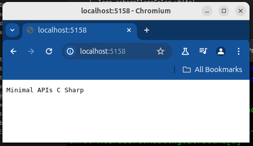
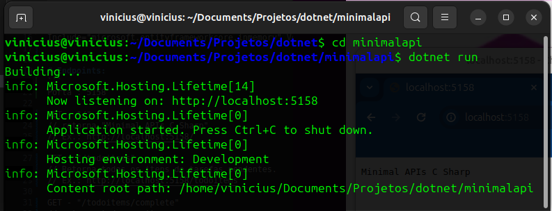

## Minimal APIs CSharp

Estudo Minimal APIs no .Net
Codificado no VSCode no Linux Ubuntu.

/minimalapi/


Nota : Minimal APIs não possui controllers.

```
Include="Microsoft.AspNetCore.Diagnostics.EntityFrameworkCore" Version="7"
Include="microsoft.entityframeworkcore.inmemory" Version="7"
```

# Endpoints:
```
Porta : 5158

GET - "/"
// retorna "Minimal APIs C Sharp"
// Ex.: http://localhost:5158/

GET - "/todoitems"
// Retorna todos os itens de tarefas pendentes.
// Ex.: http://localhost:5158/todoitems

GET - "/todoitems/complete"
// retorna todos os itens.
// Ex.: http://localhost:5158/todoitems/complete

GET - "/todoitems/{id}"
// Passar um id e retorna a tarefa deacordo com o id.
// Ex.: http://localhost:5158/todoitems/0

POST - /todoitems 
// Adicionar o objeto com a tarefa.
// Ex.: http://localhost:5158/

PUT - "/todoitems/{id}"
// Atualizar a informação do objeto se ele não for nulo.
// Ex.: http://localhost:5158/

DELETE - "/todoitems/{id}" 
// Passsa ID e Objeto a ser deletado.
// Ex.: http://localhost:5158/


```

# Crie um projeto ASP NET CORE Empty
```
Projeto vazio. Projeto mínimo apenas para funcionar. Sem a ferramenta de visualizar API(Swagger).
```
# Comando para criar um projeto ASP.NET Core Empty:
```
$ dotnet new web -n minimalapi
```
# Instale bibliotecas.
```
Comando para instale a biblioteca InMemory neste projeto:
 
$ dotnet add package microsoft.entityframeworkcore.inmemory --version 7

Comando para instale a biblioteca Diagnostics neste projeto:

$ dotnet add package Microsoft.AspNetCore.Diagnostics.EntityFrameworkCore --version 7
```

# Crie uma entidade (arquivo) Todo.cs:#

# Crie uma classe de contexto (TodoDb.cs) :

Volte na Program.cs para mapear os endpoints.

# Rodar projeto:

$ dotnet run

# testar endpoints:
```
Para testar todos os endpoints, instale a extensão Thunder Cliente no VSCode.
```



