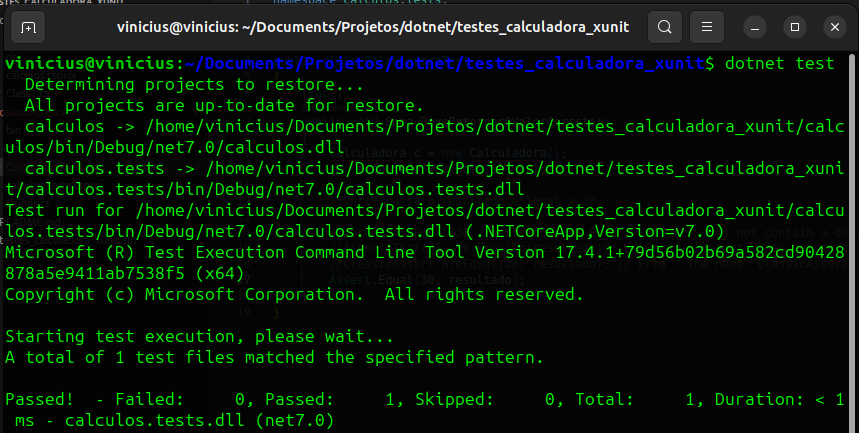

# Testes Calculadora XUnit 

Pequeno exemplo de Teste Unitario com xUnit no .Net Core 


https://github.com/ViniciusVC/dotnet/tree/main/testes_calculadora_xunit/

# Projetos nesta Solução 
```
📂 src
│   
├── 📂 /Calculadora
│   projeto de biblioteca de classes
│   Apenas para ser referenciados a partir de aplicativos .NET Core. 
│   Não roda com RUN.
│
├── 📂 /calculos.tests
    projeto de teste .NET com xUnit.
    Codigos de test em CalculadoraTest.cs.
```
Saida no terminal:


# Comandos usados para criar o projeto:
```
Crie a pasta da solução para armazenar os projetos:
$ mkdir testes_calculadora_xunit

Entrar na pasta da solução:
$ cd estes_calculadora_xunit

Criar uma solução:
$ dotnet new sln -n testes_calculadora_xunit

Criar um projeto:
$ dotnet new classlib -n calculos

Criando o projeto de teste:
$ dotnet new xunit -n calculos.tests

Adicione este projeto na solução:
$ dotnet sln testes_calculadora_xunit add calculos.tests/calculos.tests.csproj

E adicione nele a referência da biblioteca de calculos nele:
$ dotnet add calculos.tests/calculos.tests.csproj reference calculos/calculos.csproj
```

# Rodar aos testes:
> dotnet test